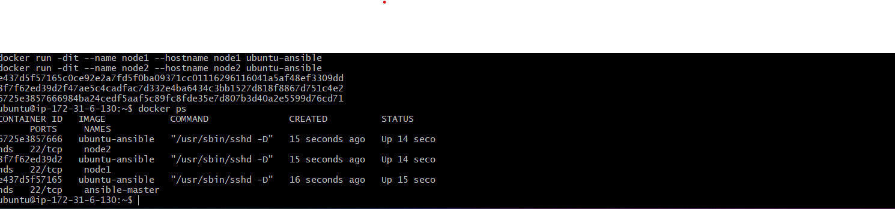

# Create an Ansible Cluster in Docker Container & Kubernetes Pod

This project demonstrates how to build a simulated multi-node Ansible cluster environment using two different container orchestration platforms:

- **Docker** for a simple Ansible control machine setup. 
- **Kubernetes (Minikube)** for deploying Ansible master and node pods, simulating a real-world cluster environment.

The goal was to manually configure everything from scratch without using any pre-built Ansible Docker images or Helm charts — ensuring complete control and better understanding of each step. This setup is ideal for DevOps learners who want to understand the manual steps behind container-based Ansible infrastructure.

---

##  Folder Structure

Ansible-multi-env-cluster/

- docker-part/
  - Dockerfile
  - inventory

- k8s-part/
  - ansible-master-pod.yaml
  - ansible-node1-pod.yaml

- screenshots/

- `docker-part/` contains a custom Dockerfile to build a minimal Ansible container and an inventory file to simulate remote nodes.
- `k8s-part/` includes YAML files to deploy an Ansible master pod and a node pod inside a Minikube-based Kubernetes cluster.
- `screenshots/` holds all the visual proofs of this setup — from container runs to Kubernetes pod execution.

---

##  Screenshots

Below are the actual screenshots captured during the process. These clearly demonstrate each important step taken in this project.

| Screenshot | Description |
|------------|-------------|
|  | Ansible successfully pinging target from the Docker container |
|  | Ansible container actively running on the EC2 instance |
|  | Docker image built with Ansible installed and inventory configured |
|  | Ansible image being built inside Kubernetes (Minikube) pod |
|  | Ansible master pod pinging the node pod inside Kubernetes |
|  | Final state: all Ansible pods running successfully in the Minikube cluster |

---

##  What We Did

###  Docker-Based Ansible Setup (on EC2)

- Created a minimal `Dockerfile` that installs Ansible on top of a clean Ubuntu base image. 
- Added an inventory file to simulate remote target machines. 
- Ran the Docker container interactively on an AWS EC2 instance to execute and test Ansible playbooks or ad-hoc commands.

###  Kubernetes-Based Ansible Cluster (on WSL + Minikube)

- Used Minikube on WSL (Windows Subsystem for Linux) to create a local Kubernetes cluster. 
- Defined two separate pod manifests: one for `ansible-master` and another for `ansible-node1`. 
- Ensured `kubectl exec` access into the master pod to allow SSH/ping testing of the node pod. 
- Simulated the working of an Ansible cluster by treating the second pod as a node being managed by the Ansible master.

---

## Tools & Technologies Used

- **Docker** – To containerize the Ansible control node. 
- **Ansible** – For remote configuration management and testing. 
- **Kubernetes (Minikube)** – To simulate a distributed cluster setup. 
- **Ubuntu (WSL + EC2)** – As the development environments. 
- **kubectl** – To manage and access Kubernetes resources manually.

---

##  GitHub Repository

🔗 [Ansible Multi-Environment Cluster](https://github.com/shreya-singh27/Ansible-multi-env-cluster.git)

---

##  Conclusion

This project gave hands-on experience in setting up Ansible on both Docker and Kubernetes without relying on prebuilt tools or shortcuts. By manually configuring each container and pod, it allowed a much deeper understanding of:

- How containerized Ansible control nodes work. 
- Inventory configuration inside containers. 
- Basic Kubernetes pod orchestration. 
- How to simulate SSH-based configuration management inside a pod environment.

This kind of dual-environment setup is extremely useful for practicing real-world DevOps use cases where infrastructure is often hybrid and containerized.  
It also strengthens troubleshooting, YAML authoring, and Ansible inventory concepts — all vital for DevOps engineers.

